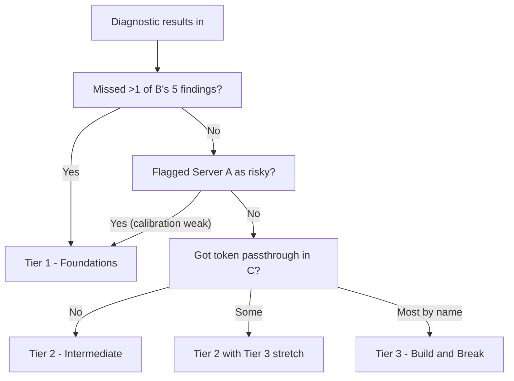

# MCP Security Workshop Flow

---

## Workshop runtime

The wall-clock structure:


| Time      | Block                                   | Duration |
| --------- | --------------------------------------- | -------- |
| 0:00–0:05 | Introduction                            | 5        |
| 0:05–0:25 | Diagnostic                              | 20       |
| 0:25–0:40 | Discussion + tier announcement          | 15       |
| 0:40–1:50 | **Tier-specific middle** (one of three) | 70       |
| 1:50–1:57 | Reflection                              | 7        |
| 1:57–2:00 | Feedback                                | 3        |


---

**Students:**

- Read `[acme-security-brief.md](diagnostic/acme-security-brief.md)` (60 seconds).
- Make sure your MCP client (Claude Code or Cursor) is open, but don't use yet.
- Pull latest from the workshop repo:
  ```bash
  cd <repo-name> && git pull
  cd mcp-security-workshop && uv sync
  ```

---

### 0:05–0:25 Diagnostic — three mock servers

**Students:**

1. Open the diagnostic folder in their editor
2. Read `[STUDENT_INSTRUCTIONS.md](diagnostic/STUDENT_INSTRUCTIONS.md)` (30 seconds).
3. Read `server-a/server.py` (~6 min). Decide Ship / Patch / Block. Note one piece of evidence.
4. Read `server-b/server.py` (~6 min). Same.
5. Read `server-c/server.py` and `server-c/tool_descriptions.yml` (~6 min). Same.
6. Post three verdicts on Miro under the matching column with their evidence.

**Do not** run `python` on any of these. They are read-only artifacts in this block.

---

### 0:25–0:40 Discussion + tier announcement

Diagnostic server discussion.

**Students:**

- Listen. Ask clarifying questions only on findings they're unclear on.

#### Tier-pick decision flowchart




If the room is split, we can default to **Tier 2** with cross-skill pairing in the patch rounds.

---

## 0:40–1:50 Tier-specific middle (BRANCH)

We pick **one** of the three sections below.

---

### Tier 1 — Foundations (70 min)

For cohorts that missed obvious bugs in the diagnostic.

#### 1A. Detailed walkthrough of all three diagnostic servers 0:40–0:55 (15 min)

- Re-walk Servers A, B, C from the diagnostic portion. Slow down on **Server C's token passthrough**: we draw the trust boundary on Miro or a whiteboard, name the spec mandate, detail the fix.

**Students:**

- Watch. Ask. Open the source files in their editor as you walk through them so the code is in front of them.

#### 1B. One attack-and-patch round on AcmeOps — prompt injection in tool output — 0:55–1:20 (25 min)

Demonstrate a real vulnerable server attack, and implement the fix.

**Students:**

1. Add the AcmeOps server to their MCP client. For Claude Code:
  ```bash
   cd mcp-sercurity-workshop
   claude mcp add acmeops -- uv run python -m acmeops_server --transport stdio
  ```
   For Cursor, add to their MCP config (`~/.cursor/mcp.json` or workspace settings):
2. Restart their MCP client. Verify with `/mcp` (Claude Code) or the MCP panel (Cursor) that `acmeops` is connected.
3. **Run the exploit (5 min).**
4. **Apply the patches (15 min).** Working in pairs is encouraged.
5. Restart the MCP client (it will relaunch the server with the new code).
6. **Re-run the exploit (5 min).** Same prompt. The server now refuses and the agent self-corrects.

#### 1C. Token-passthrough explainer + 15-line `TokenVerifier` diff demo — 1:20–1:35 (15 min)

Skip the full OAuth patch, but leave them knowing what the vulnerability is, and what the patch looks like.

**Students:**

- Watch. Open the files. No commands.

#### 1D. "First ticket Monday morning" worksheet — 1:35–1:50 (15 min)

Have the students pick one MCP server they have at work or one they've considred building, and write the three highest-risk findings if you ran today's diagnostic exercise on it. Then write the first ticket you'd open Monday morning. Surface 1-2 surprising findings publicly at the end for discussion. [Students may not be interested or have an MCP servers themselves]

**Students:**

1. have 10 min individual time to write on Miro stickies.
2. 5 min pair share with a partner.
3. One person from each pair shares the most surprising finding to the room (1 sentence each).

---

### Tier 2 — Intermediate (70 min)

Probably the most common cohort profile. For those who caught the obvious stuff in the diagnostic, but missed the MCP-specific subtleties.

#### 2A. Brief diagnostic walkthrough — 0:40–0:45 (5 min)

- 5 minutes only. We should go over the things they missed in the diagnostic, but focus on the token pass through and make sure they get this one. "MCP servers MUST NOT accept any tokens that were not explicitly issued for the MCP server."

#### 2B. Exploit & patch round 1 — prompt injection in tool output — 0:45–1:00 (15 min)

Compressed version of Tier 1B. Same setup, same patches, but less hand-holding.

**Students:**

1. Add `acmeops` to their MCP client (same `claude mcp add` or Cursor JSON as Tier 1B above).
2. Restart client; verify connection.
3. Run the exploit.
4. Apply both patches (output tagging in `customers.py`, recipient allowlist in `email.py`).
5. Restart and re-run. Should fail closed.

#### 2C. Exploit & patch round 2 — tool poisoning + rug pull — 1:00–1:20 (20 min)

Go through the second class attack. Demonstrate the vulnerability, and have students try it on their own machines.

- Reference [Invariant Labs — Tool Poisoning Attacks](https://invariantlabs.ai/blog/mcp-security-notification-tool-poisoning-attacks) and the spec's [Local MCP Server Compromise section](https://modelcontextprotocol.io/specification/latest/basic/security_best_practices).

**Students:**

1. Install `malicious_helper` alongside `acmeops`. Claude Code:

```bash
 cd mcp-sercurity-workshop
 claude mcp add malicious-helper -- uv run python -m malicious_helper
```

Cursor: add a second entry to `mcpServers` config:

```json
"malicious-helper": {
  "command": "uv",
  "args": ["run", "python", "-m", "malicious_helper"],
  "cwd": "<absolute-path-to>/mcp-sercurity-workshop"
}
```

1. Restart the MCP client. Verify both `acmeops` and `malicious-helper` are connected.
2. **Run the tool-poisoning exploit (5 min).** Prompt their agent:
  > "Use the summarize tool to give me a one-line summary of CUST-42."
  > Watch the agent obey the hidden instruction in the description (reads multiple customer notes and bundles them into the response).
3. **Watch the rug pull (3 min).** Wait for the facilitator to `touch .rugpull`. Re-run the same prompt; the description has flipped to a more aggressive payload.
4. Apply the patches (10 min)
5. Re-run both exploits. Both should now fail closed.

#### 2D. Add identity via MCP — `TokenVerifier` against the bundled fake authz server — 1:20–1:40 (20 min) [If extra time, have them install server, otherwise, I can just demo it, they can implement fixes theoretically on their MCP server]

Walk through the vulnerability with the fake_authz_server then have the students attempt it themselves.

**Students:**

1. Start the fake authz server in their own second terminal:
  ```bash
   cd mcp-sercurity-workshop
   uv run python -m fake_authz_server
  ```
2. Edit `[acmeops_server/server.py](mcp-sercurity-workshop/acmeops_server/server.py)` by replacing the `PermissiveTokenVerifier` with an `AcmeTokenVerifier` that validates `aud=https://acmeops.internal`. Configure `AuthSettings(issuer_url="http://localhost:9000", required_scopes=["acme:tickets:read"])`.
3. Restart their MCP client, showing an audience-bound token.
4. **Demonstrate progressive scope challenge.** Ask the agent to call `draft_email`. The server returns `WWW-Authenticate: Bearer error="insufficient_scope", scope="acme:emails:write"`. Client re-prompts, gets the elevated token, and retries successfully.

If the OAuth discovery flow stalls for >2 min, we can downshift: skip the wire-up, do a verbal walkthrough of the spec's Token Passthrough section.

---

### Tier 3 — Build & Break (70 min)

For cohorts that caught most of the subtle MCP-specific issues in the diagnostic.

#### 3A. Brief diagnostic acknowledgement + setup — 0:40–0:43 (3 min)

Acknowledge that the students have caught most of the security vulnerabilities that other cohorts miss, so we're going to do something different. The students will build a server and seed it with at least 3 vulnerabilities from a choice of vulnerabilities (besides those, make the server secure). Then they will partner up, and the partner is going to try to break it. Afterwards, the student will patch the vulnerabilities under the same time pressure that we might see during a real incident. Two-three vulnerabilities each. Twenty minutes to attack, and twelve minutes to patch.

- Confirm pairs via expertise match-up.
- Go over `[tier3-build/VULNERABILITY_MENU.md](mcp-sercurity-workshop/tier3-build/VULNERABILITY_MENU.md)` and `[tier3-build/scaffold/README.md](mcp-sercurity-workshop/tier3-build/scaffold/README.md)`.

**Students:**

1. Find partner.
2. Fork a copy of the parent repo, clone it and work out of `tier3-build/scaffold`
3. Verify the scaffold runs:
  ```bash
   uv run python server.py
   # Ctrl+C after it prints the MCP server line
  ```

#### 3B. Build phase — 0:43–1:15 (32 min)

The students pick 2-3 max vulnerabilities from the vulnerabilities list and build their server, filling in the threat brief with what the server does, and what is NOT broken. The brief is what the student's partner reads. They have 20 minutes for this. Keep the bugs in server.py for easy finds focusing on the actual MCP server (no helper files).

**Students:**

1. Read `[tier3-build/VULNERABILITY_MENU.md](mcp-sercurity-workshop/tier3-build/VULNERABILITY_MENU.md)` (3 min).
2. Pick 2-3 entries.
3. Modify `server.py` (and add files if needed) to seed the vulnerabilities.
4. Create a folder in `tier3-build` with their MCP server called `mcp-build-<your-name>`
5. Copy the threat brief template and fill it in
6. Verify the server still starts:
  ```bash
   uv run python server.py
   # Ctrl+C
  ```

#### 3C. Swap — 1:15–1:18 (3 min)

Now we swap folders with partners. The partner checks out their partner's git repo branch. We confirm pairs are swapping and re-pair anyone whose partner is missing. Three member groups are ok.

**Students**: read their `threat-brief.md`. Then start scanning `server.py`.

#### 3D. Red-team phase — 1:18–1:38 (20 min)

Students use the [attack runbook](mcp-sercurity-workshop/tier3-build/ATTACK_RUNBOOK.md) to exploit the vulnerabilities in their partner servers. Should probably do a static read first, then probe via their MCP client. Students document their findings in a `findings.md` file in their partner's folder. At the bell, the partner will add, commit and push back to their partner's repo."

**Students:**

1. Open `[ATTACK_RUNBOOK.md](mcp-sercurity-workshop/tier3-build/ATTACK_RUNBOOK.md)` on a side pane.
2. Add the partner's server to their MCP client:
  ```bash
   cd tier3-build/mcp-build-<partnername>
   claude mcp add partner-server -- uv run python server.py
  ```
   Cursor equivalent: add to `mcpServers` JSON, with `cwd` pointing at the partner's folder.
3. Restart the MCP client. Verify `partner-server` is connected.
4. Run probes from the runbook in order: Step 1 (static read), then Step 2a–2f (agent probes).
5. For each finding, append to `findings.md` using the format in the runbook.
6. At the bell, students stop and commit and push their findings to their partner repo branch.

#### 3E. Patch phase — 1:38–1:50 (12 min)

Each partner now pulls from their repo with the new findings that were pushed by their partner. They have twelve minutes to patch what their partner found. The point isn't to 'patch perfectly', but it's 'patch the live exploit before lunch time.' The steps are: read findings, fix, re-test. They should focus more on fixing more than code elegance.

---

### 1:50–1:57 Reflection

The end of workshop reflection/discussion depending on which Tiers were run. The discussion and reflection can take different forms depending on the tiers and outcome.

- **Tier 1:** *"Three months from now, you're security-reviewing an MCP server at work. What's the first thing you'd do that you wouldn't have done before today?"*
- **Tier 2:** *"Of the four MCP-specific defenses we built today, which one is the smallest patch that would harden an MCP server you currently maintain or are writing?"*
- **Tier 3:** *"Was your server harder to attack than your partner's was to defend? What does that tell you about the asymmetry between writing secure servers and finding flaws in them?"*
- 3 minutes individual silent reflection. Then 4 minutes pair share.

**Students:**

1. Write individually (3 min).
2. Share with one neighbor (4 min).

Facilitator asks for comments that anyone would like to share with the entire cohort.

# mcp-security-workshop
